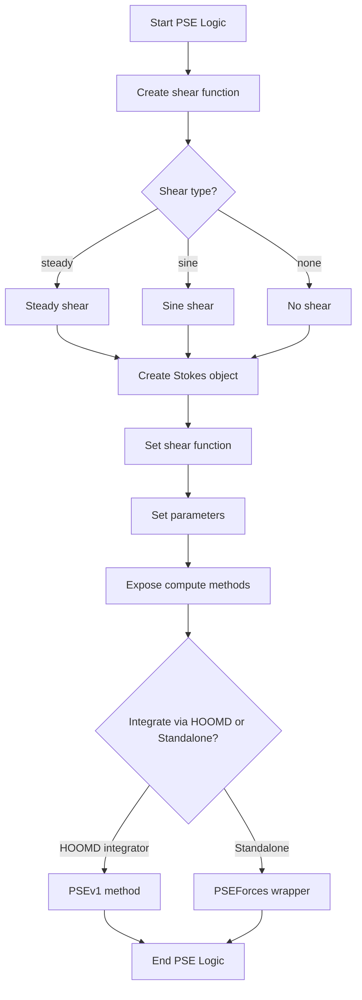
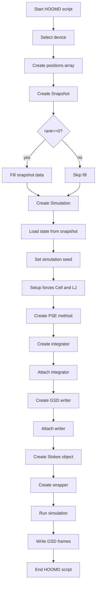

# PSE and HOOMD Flowcharts

This file contains two separate flowcharts (Mermaid format):
1. PSE internal logic (PSE algorithm flow)  
2. HOOMD integration logic (how HOOMD sets up and runs simulation while exposing PSE)

Each flowchart is followed by a short explanation of the nodes.

---

## 1) PSE Internal Logic (Mermaid flowchart)

### PSE Logic Explanation:
- **Create shear function**: PSE provides several shear functions (steady, sine, chirp). They return a `cpp_function` pointer used by the C++ PSE object.
- **Stokes object**: Low-level C++ object providing Stokes hydrodynamic computations and GPU kernel access.
- **Set shear/parameters**: Configure PSE behavior (shear, thermal energy, split parameter xi, error tolerance).
- **Expose methods**: PSE exposes compute methods to Python/C++ wrappers so HOOMD can call them.
- **Final decision**: PSE can be integrated into HOOMD as `hoomd.pse.methods.PSEv1`, or used standalone via a wrapper class and pybind11 module.

---

## 2) HOOMD Integration Logic (Mermaid flowchart)

### HOOMD Integration Logic Explanation:
- **Select device**: Chooses CPU/GPU automatically based on availability.
- **Snapshot**: HOOMD-4 uses snapshots to initialize particle data rather than writing and reloading GSD frames.
- **Load state from snapshot**: Loads snapshot into `hoomd.Simulation`.
- **Setup forces**: Neighbor list and pair potentials (LJ) are attached before integration.
- **PSE method**: PSE is created as a `hoomd.pse.methods.PSEv1` method and passed to the integrator alongside forces.
- **Writers**: Use HOOMD writer plugins with triggers for periodic output (every N steps).
- **Wrapper**: Optional wrapper that runs simulation and provides direct access to Stokes object for advanced usage.

---

## Data Flow Summary

### Top-level script flow (run_pse_steady.py):
1. Import modules (HOOMD, PSE, NumPy, GSD)
2. **Step 1**: Demonstrate PSE functionality (create objects, set parameters)
3. **Step 2**: Create HOOMD-4 compatible simulation
4. **Step 3**: Integrate PSE as external physics engine (wrapper)
5. **Step 4**: Run enhanced simulation and output trajectory

### Per-timestep flow (inside HOOMD integration loop):
1. Integrator calls PSE method
2. PSE method calls CUDA kernels (GPU physics)
3. PSE method returns forces
4. HOOMD integrator applies forces to particles
5. Writer captures frame if trigger fires
6. Loop continues to next timestep

---

## Files Compared

- **HOOMD 4.0 Version**: `/home/mohit/pse_v2/pse-fork/examples/run.py` (151 lines)
- **HOOMD 4.9 Version**: `/home/mohit/pse/examples/run_pse_steady.py` (194 lines)

Both follow similar control flow, but 4.9 has:
- Better separation of PSE (direct module) and HOOMD integration (wrapper)
- More detailed error handling and status reporting
- PSEEnhancedSimulation class for flexible integration
